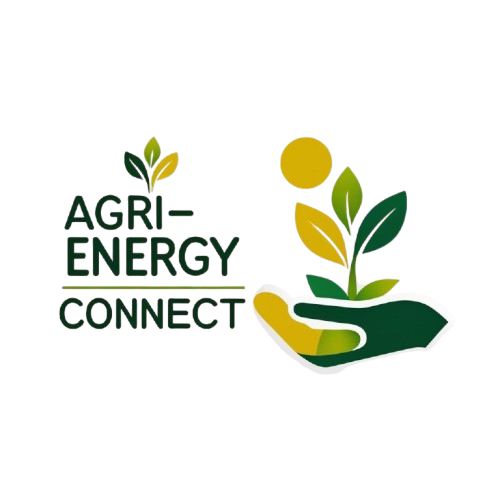

# Agri-Energy Connect: Vision for Sustainability
*master branch created for PART 3 - PART 2 web application prototype resubmission -*

South Africa's agriculture is evolving. Agri-Energy Connect is the next step forward - combining farming and clean energy. A digital bridge between farmers and green energy providers in South Africa.

> [](https://youtu.be/aOyxKV9g2YE)

## Setup Instructions 

Follow these steps to set up Agri-Energy Connect **with the pre-configured database**:

### ✅ Step 1: Install Dependencies
Ensure these are installed:
- [Visual Studio 2022+](https://visualstudio.microsoft.com/) (with **ASP.NET and .NET 8 SDK** workload)
- [SQL Server Management Studio (SSMS)](https://aka.ms/ssmsfullsetup)
- [GitHub](https://git-scm.com/downloads) (for cloning)

---

### ✅ Step 2: Clone and Open the Project
1. **Clone the repository**:
   ```bash
   git clone https://github.com/ST10252746/PROG7311_POE_PART_2.git 
   ```
2. Open the solution in Visual Studio:
   - Launch Visual Studio → "Open a project or solution" → Select `ST10252746_PROG7311_POE_PART_2.sln`

---

### ✅ Step 3: Restore the Database
1. **In SSMS**:
   - Connect to your SQL Server instance (usually `.\SQLEXPRESS` or `localhost`)
   - Right-click **Databases** → **Restore Database**
   - Select **Device** → Add → Browse to the `AgriEnergyConnectDB2.bak` file from the repo
   - Click **OK** to restore

2. **Verify the database**:
   - You should now see `AgriEnergyConnectDB2` in your SSMS databases list

---

### ✅ Step 4: Configure the Connection String
1. In Visual Studio:
   - Open `appsettings.json`
   - Replace the connection string with your server details:
     ```json
     "DefaultConnection": "Server=YOUR_SERVER_NAME;Database=AgriEnergyConnectDB2;Trusted_Connection=True;MultipleActiveResultSets=true"
     ```
   - For local SQL Express, typically use:
     ```json
     "Server=.\\SQLEXPRESS;..."
     ```

---

### ✅ Step 5: Run Database Scripts (If Applicable)
1. In SSMS:
   - Open the provided `database script.sql` from the repo
   - Execute it against the restored database (`AgriEnergyConnectDB2`)

---

### ✅ Step 6: Run the Application
1. In Visual Studio:
   - Press **F5** or the green ▶️ "Start" button
   - The app will launch at `https://localhost:7171` (port may vary)

---

### Troubleshooting
- **Connection issues?** Verify:
  - SQL Server is running (check via SSMS)
  - Your connection string matches your server name
  - The database name is exactly `AgriEnergyConnectDB2`
- **Missing dependencies?** Ensure:
  - .NET 8 SDK is installed (`dotnet --list-sdks` in terminal)
  - NuGet packages are restored (right-click solution → "Restore NuGet Packages")

---
    
## Application Flow and User Roles
The application has three roles:

### Admin
- Creates Employee and Farmer roles
- Creates Employee accounts with login credentials

### Employee
- Logs in with provided credentials
- Can add new farmers and manage their profiles
- Views and filters products added by farmers

### Farmer
- Logs in with credentials created by an Employee
- Can add products with details
- Can view their own product list
